# my-bookmark-master (pocket bookmark)

### [中文](README.md) | English

Technical architecture: Mainly Kotlin language, based on Material Design + MVP + RxJava + Retrofit + Glide and other open source frameworks
, the old 4.0.0 following Java language [pocket bookmarks] (https://github.com/kellysong/my-bookmark-master/tree/master) maintenance

Features:
Set learning, convenience, entertainment in one of the comprehensive software, suitable for junior and intermediate Android developers, you can learn:

1. Various uses of various third-party libraries
2. Different implementation methods of the same similar function, original writing method and frame-based writing method
3. Encapsulate common methods and transform third-party libraries
4. Practical application of various similar functions
5. ### ** can inspire your projects **'

# Technical Architecture

- View binding (hybrid) : findViewById, ButterKnife, kotlin synthetic (Kotlin-Android-Extensions)

- Asynchronous invocation and Thread switching: Handler+Thread, RxJava

- Network Request (hybrid) : RxJava+Retrofit

- Data parse: Gson

- Image load: Glide

- Database: GreenDao

- Log: Log, custom log

- Route: startActivity

- EventBus (hybrid) : EventBus, RxBus(based on RxJava implementation)

- permission request: PermissionsManager under the permission package

- Memory leak monitoring: LeakCanary

- Online monitoring: Bugly

- Screen adaptation: Toutiao adaptation

# Function Description
- Google Browser bookmark parsing;
- Implement part of wanAndroid interface;
- Support uploading my collections to my own service
- Personal account management, bus card balance query, WIFI password view (Root access)
- Realize part of zhihu news interface
- Realize express query (integrate and modify the third party), novel reading (integrate and modify the third party)
- Other functions: article backup and synchronization, theme change, language change, gesture password setting, etc

# Apk Download

[Installation Package](Pocket_bookmark.apk)
[Update log](口袋书签app更新说明.md)

# ScreenShot

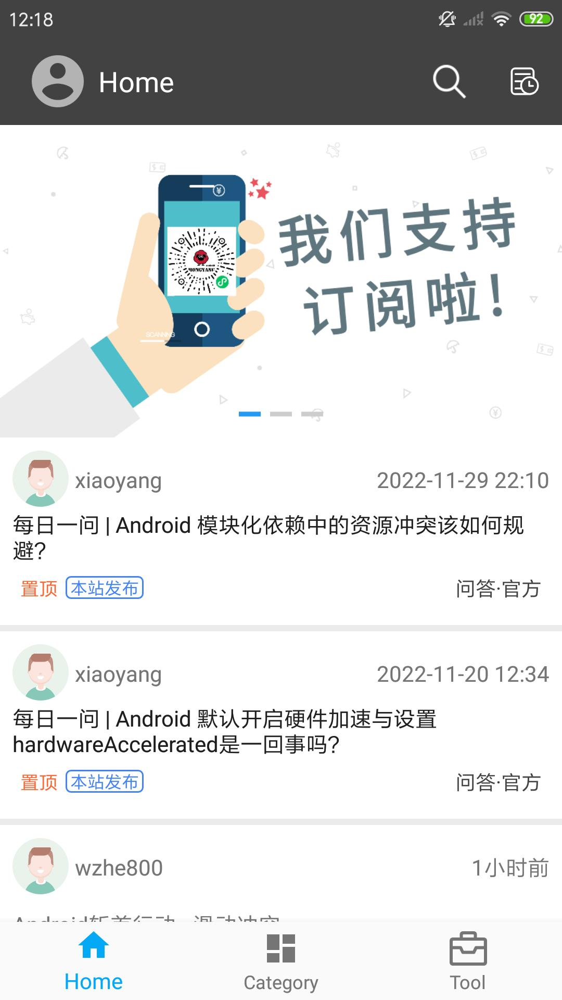
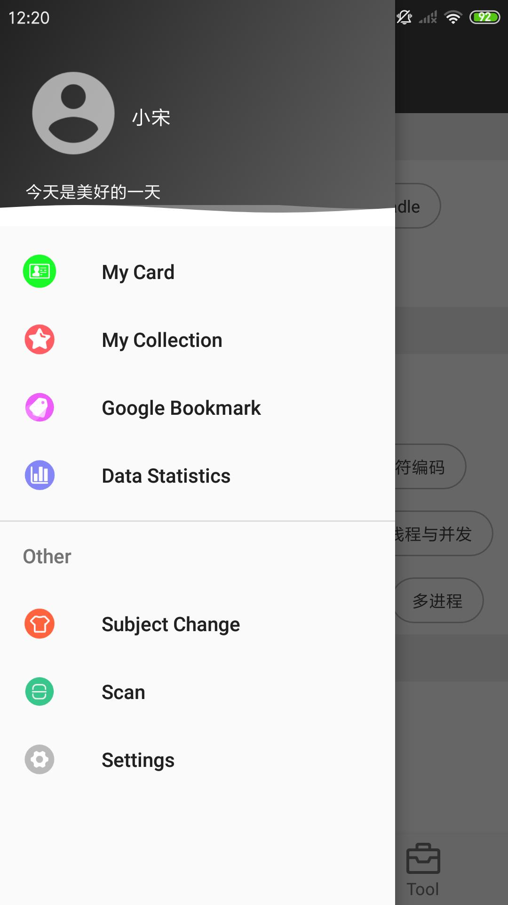
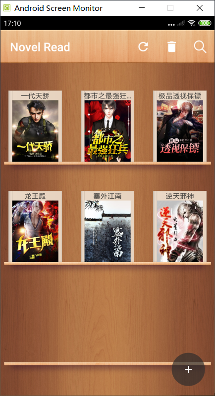
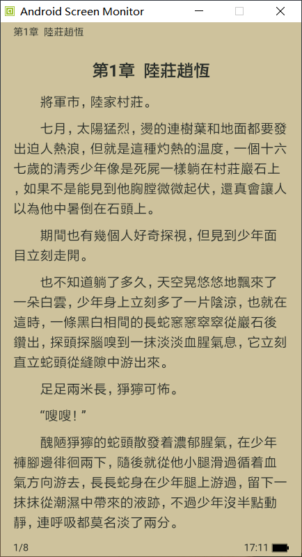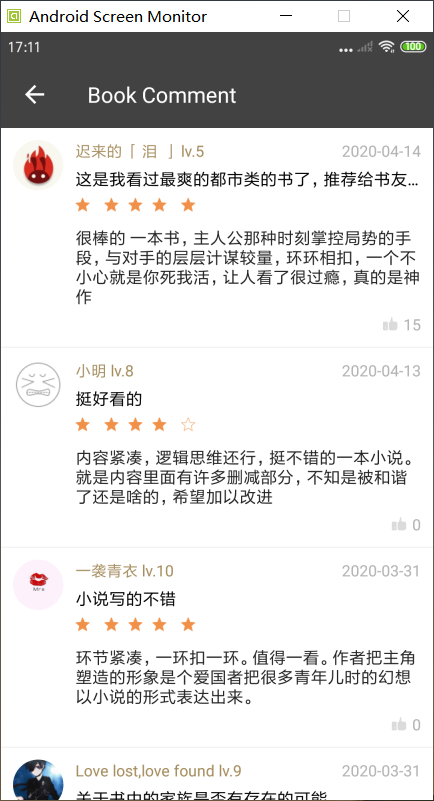
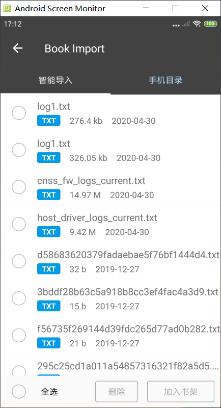
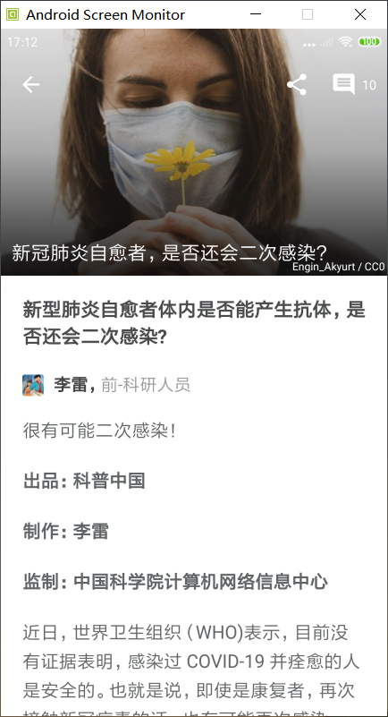
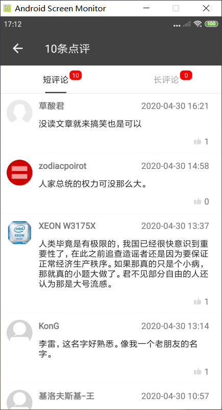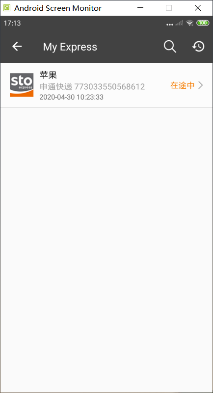
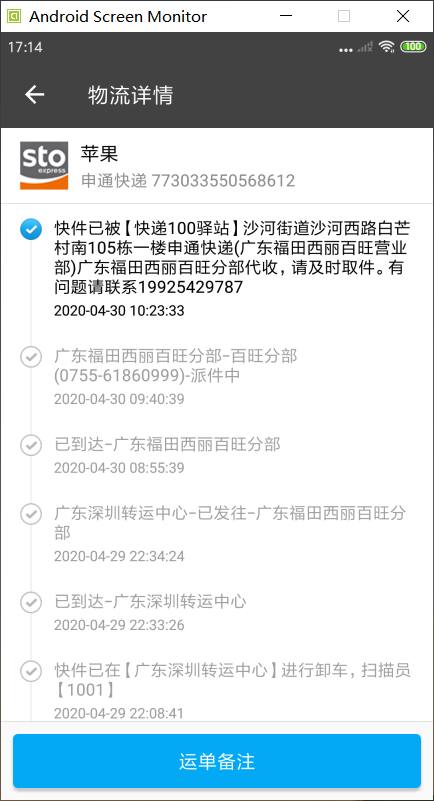
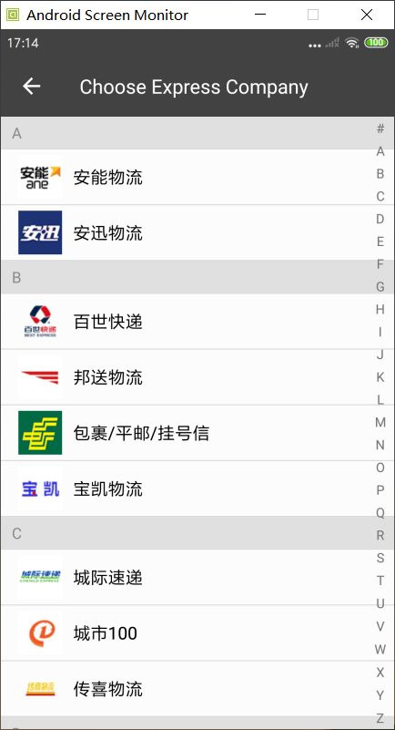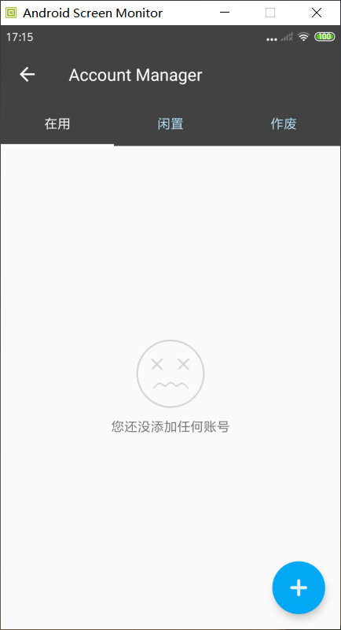
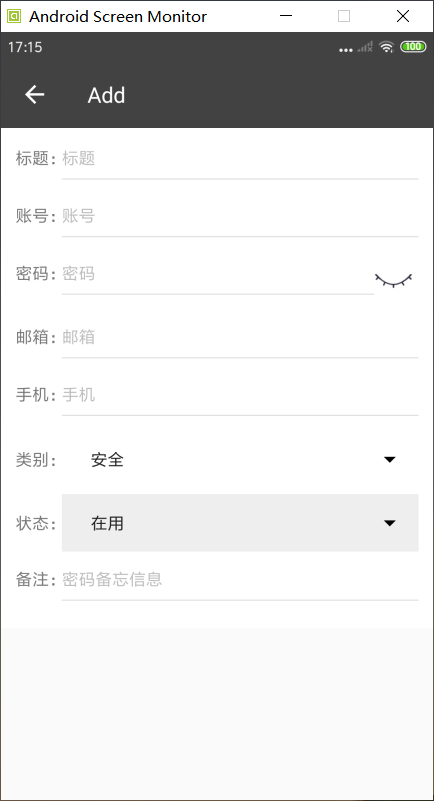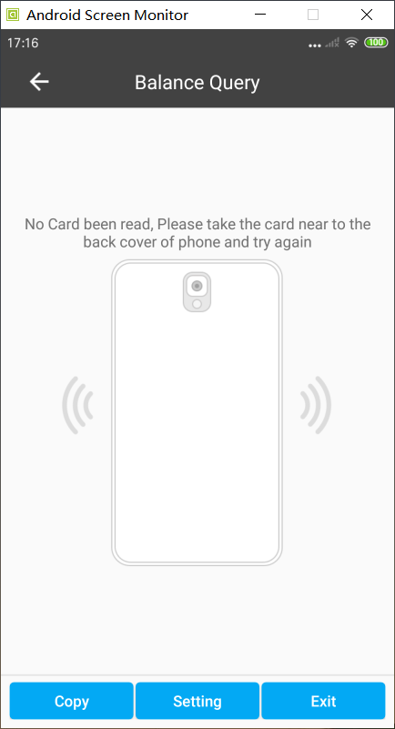

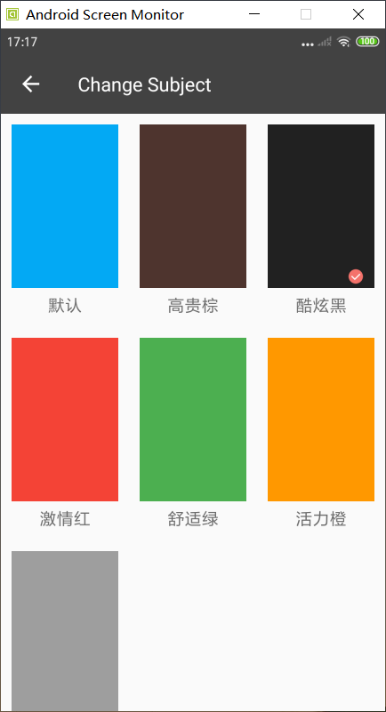
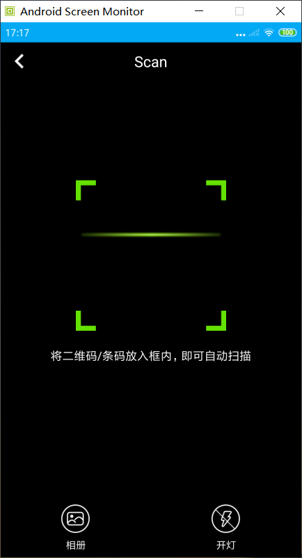

# License

    Copyright 2018 Song Jiali

    Licensed under the Apache License, Version 2.0 (the "License");
    you may not use this file except in compliance with the License.
    You may obtain a copy of the License at

        http://www.apache.org/licenses/LICENSE-2.0

    Unless required by applicable law or agreed to in writing, software
    distributed under the License is distributed on an "AS IS" BASIS,
    WITHOUT WARRANTIES OR CONDITIONS OF ANY KIND, either express or implied.
    See the License for the specific language governing permissions and
    limitations under the License.