# my-bookmark-master（口袋书签）

### 中文 | [English](README-en.md)

技术架构：主要Kotlin语言，基于 Material Design + MVP + RxJava + Retrofit + Glide等开源框架开发
，旧版4.0.0以下Java语言编写的[口袋书签](https://github.com/kellysong/my-bookmark-master/tree/master)停止维护

特点：
集学习、便民、娱乐于一体的综合软件，适合初中级Android开发者，能学到：
1. 各种不同第三方库的各种用法
2. 同种类似功能不同实现方法,原始写法和基于框架的写法
3. 常用方法封装和第三方库改造
4. 各种类似功能的实际应用
5. ### **能给你的项目开发带来灵感**

# 技术架构

- View绑定（混合）：findViewById、ButterKnife、Kotlin synthetic（kotlin-android-extensions）
- 异步调用和线程切换（混合）：Handler+Thread、RxJava
- 网络请求：RxJava+Retrofit
- 数据解析：Gson
- 图片加载：Glide
- 数据库：GreenDao
- 日志：Log、自定义Log
- 路由：startActivity
- 事件总线（混合）：EventBus、RxBus(基于RxJava实现)
- 权限申请：permission包下的PermissionsManager
- 内存泄露监控：LeakCanary
- 线上监控：Bugly
- 屏幕适配：今日头条适配

# 功能说明
- 实现Google浏览器收藏书签解析；
- 实现wanandroid部分接口；
- 支持我的收藏上传到自己的服务
- 实现个人账户管理、公交卡余额查询、WIFI密码查看（需要Root权限）
- 实现知乎新闻部分接口
- 实现快递查询（集成和修改第三方）、小说阅读（集成和修改第三方）
- 其它功能：文章备份和同步、主题更换、语言更换、手势密码设置等

# apk下载
[安装包](pocket_bookmark.apk)

[更新日志](口袋书签app更新说明.md)

# 效果图

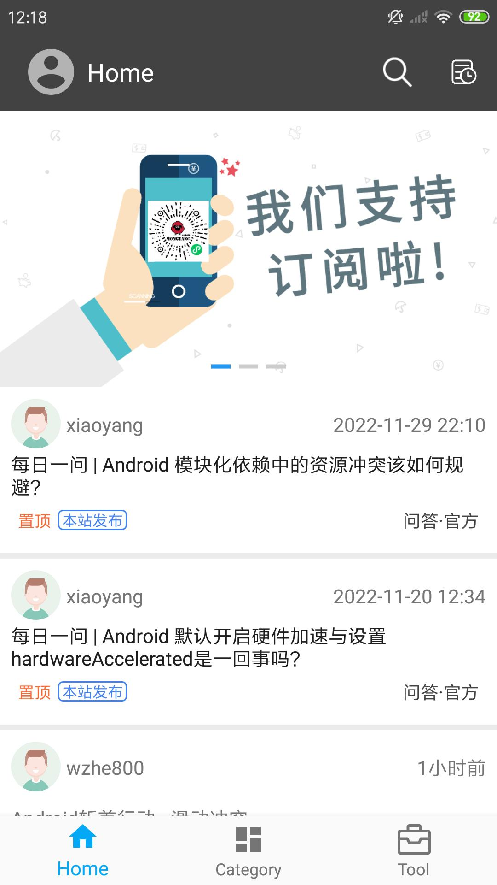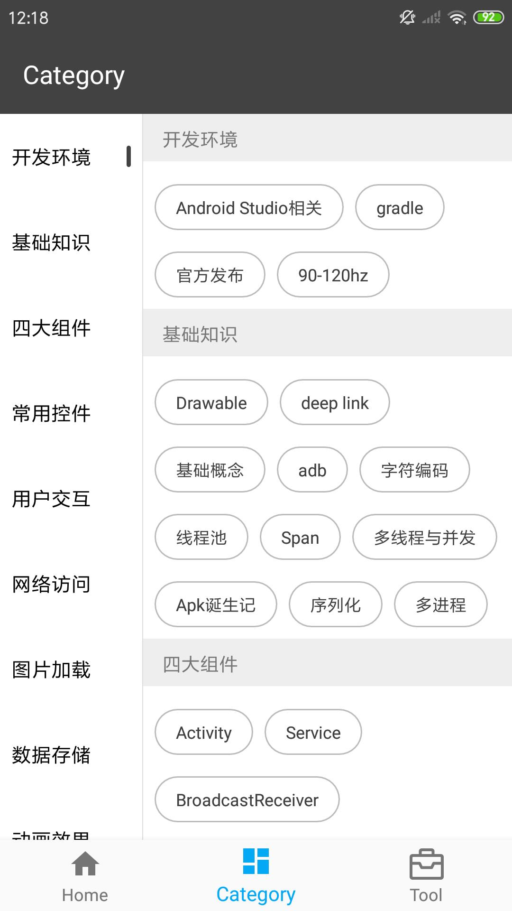
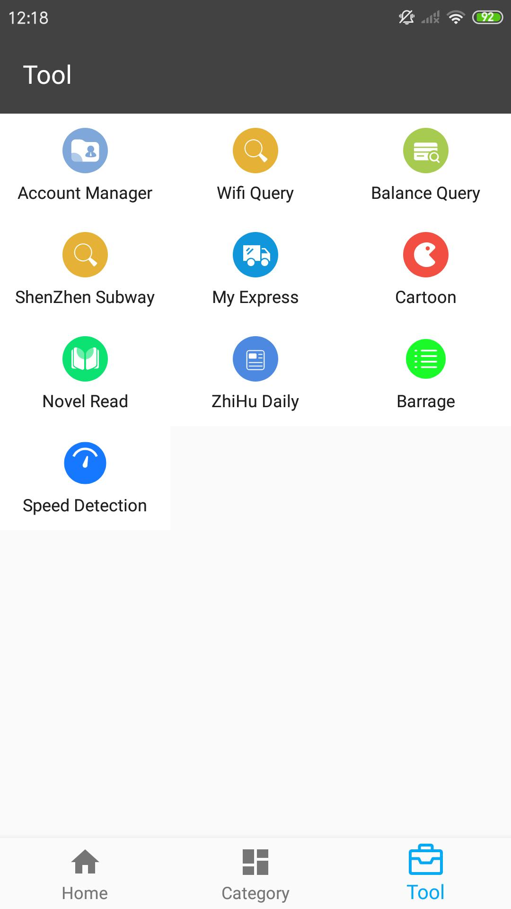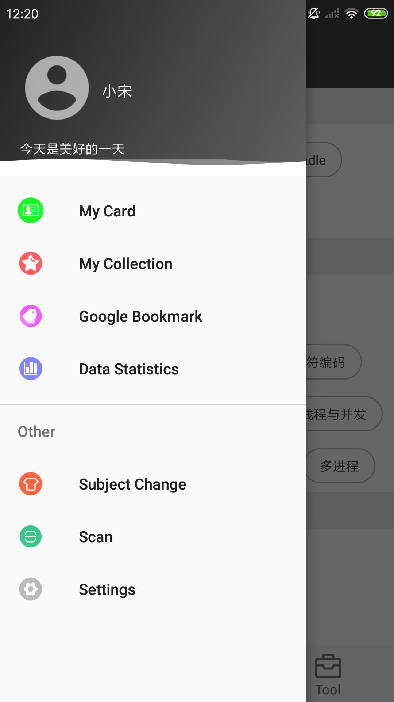
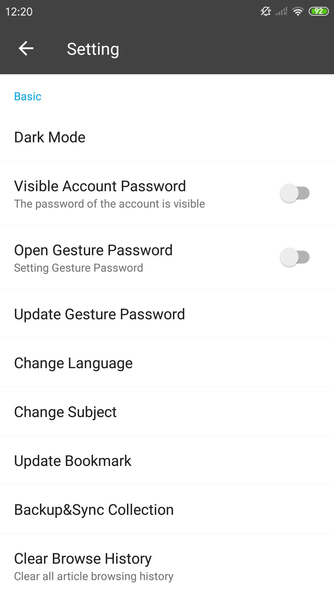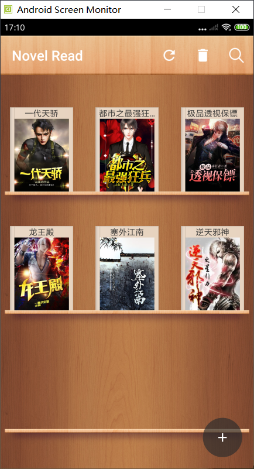
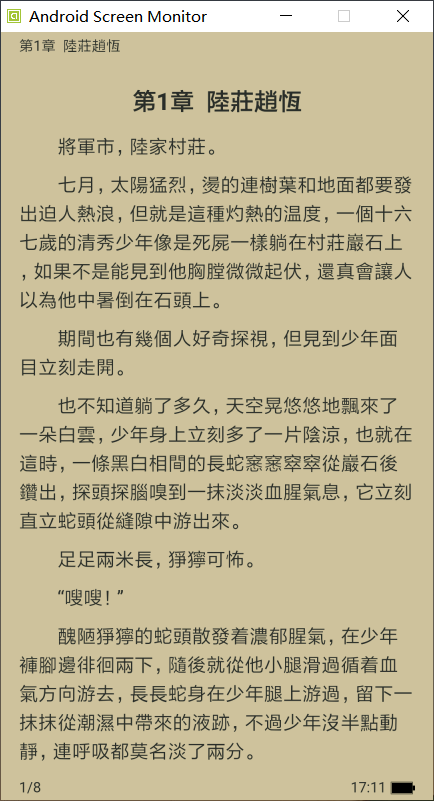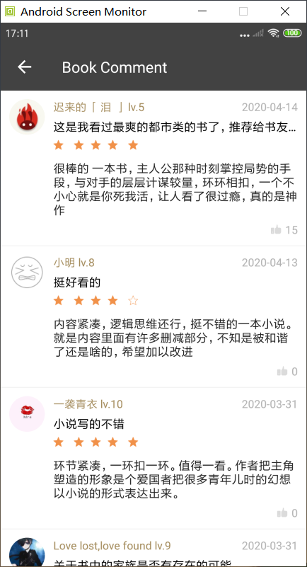
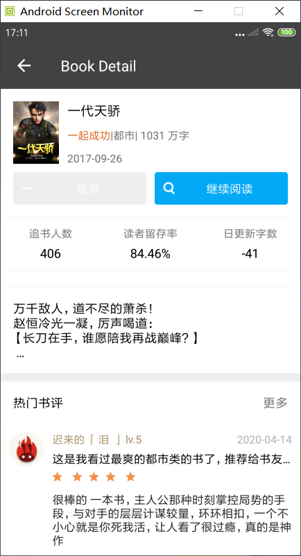
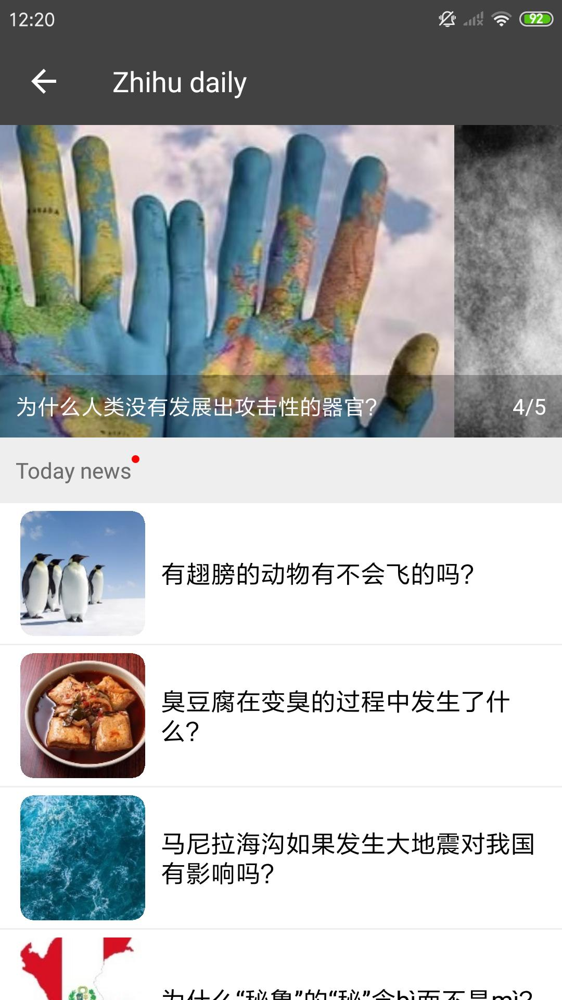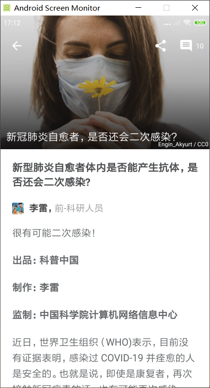
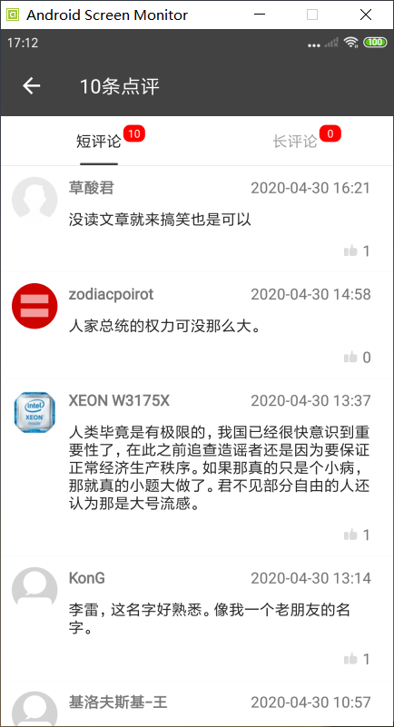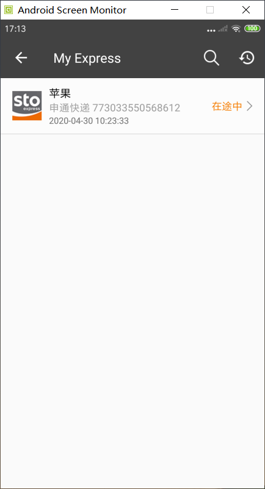
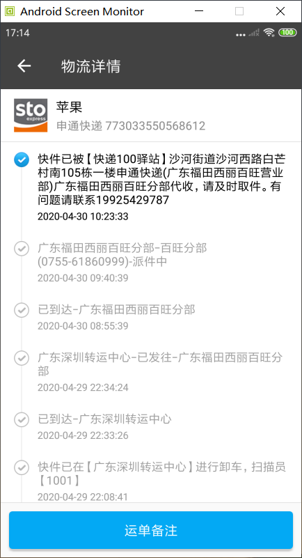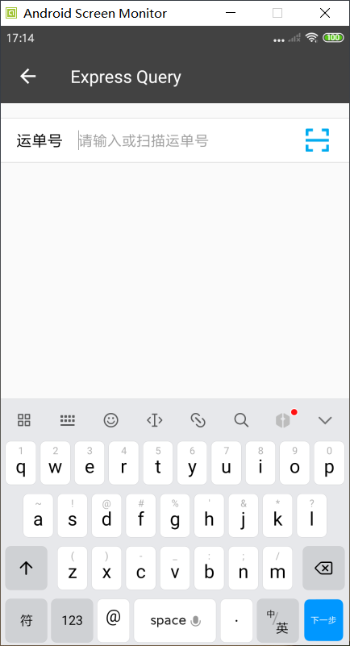
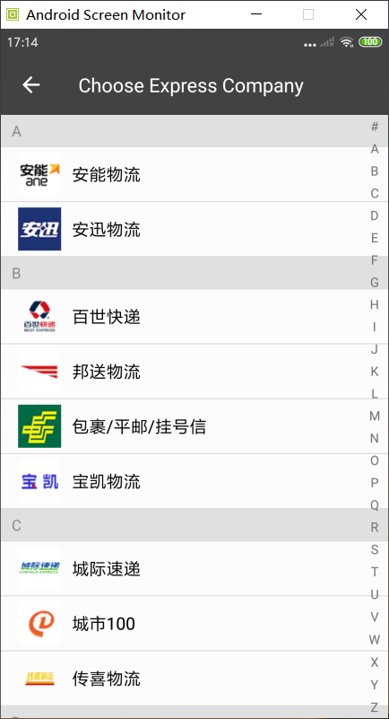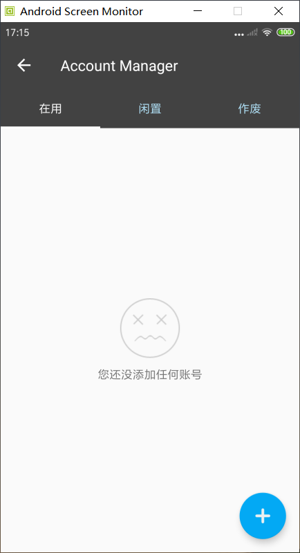
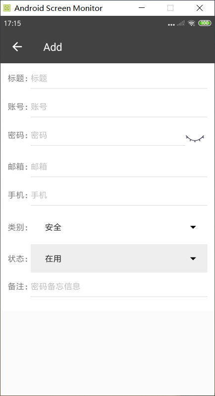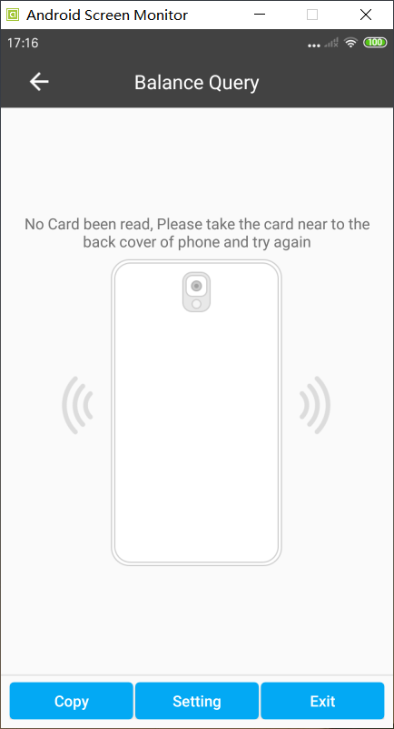
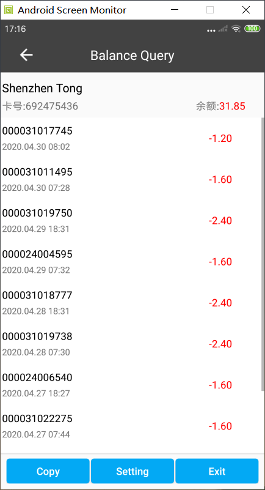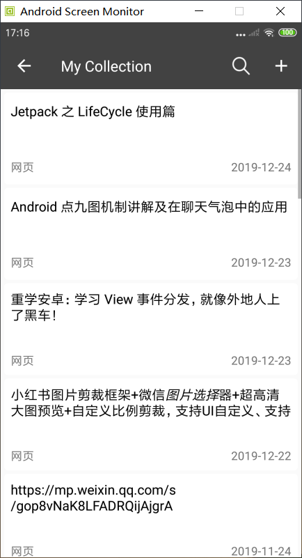
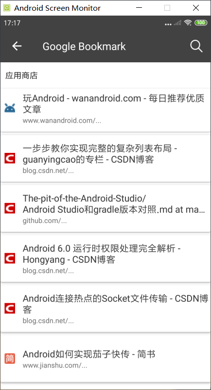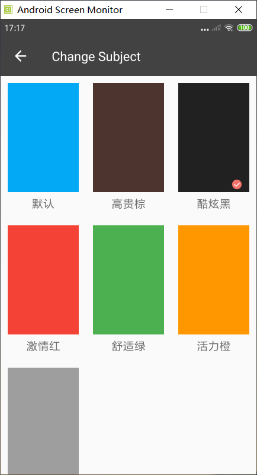
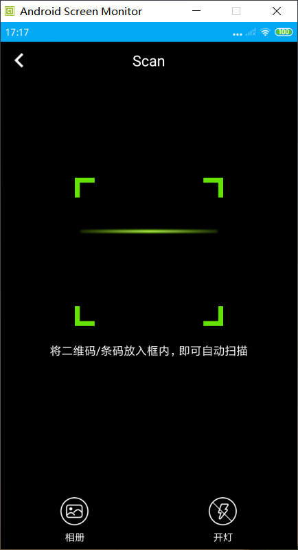

# License

    Copyright 2018 Song Jiali

    Licensed under the Apache License, Version 2.0 (the "License");
    you may not use this file except in compliance with the License.
    You may obtain a copy of the License at

        http://www.apache.org/licenses/LICENSE-2.0

    Unless required by applicable law or agreed to in writing, software
    distributed under the License is distributed on an "AS IS" BASIS,
    WITHOUT WARRANTIES OR CONDITIONS OF ANY KIND, either express or implied.
    See the License for the specific language governing permissions and
    limitations under the License.